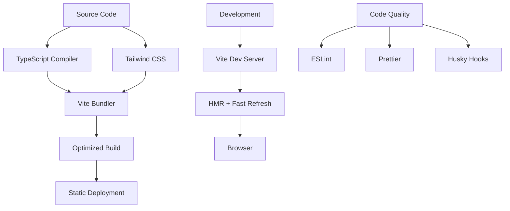

# ADR-001: Modern Frontend Stack Migration

**Author:** Ernesto Jiménez Villaseñor  
**Date:** 2025-09-05  
**References:** Current vanilla React implementation

## Context

The current CV portfolio project uses a minimal setup with vanilla HTML, CDN-loaded React, and browser-based Babel transpilation. While this approach works for simple prototypes, it lacks the tooling, performance optimizations, and developer experience necessary for a professional portfolio site.

The project needs to evolve into a modern, maintainable, and performant web application that showcases technical expertise and follows industry best practices.

## Decision

We will migrate to a modern frontend stack consisting of:

- **Build Tool:** Vite
- **Framework:** React 19 with TypeScript
- **Styling:** Tailwind CSS
- **Code Quality:** ESLint, Prettier, and Husky for pre-commit hooks
- **Development:** Hot Module Replacement (HMR) and fast builds

## Evaluated Alternatives

| Alternative          | Pros                                                 | Cons                                                                  | Decision        |
| -------------------- | ---------------------------------------------------- | --------------------------------------------------------------------- | --------------- |
| **Current Setup**    | ✅ Simple ✅ No build step                       | ⚠️ No TypeScript ⚠️ Poor performance ⚠️ Limited tooling       | ❌ Rejected     |
| **Create React App** | ✅ Zero config ✅ Established                    | ⚠️ Slower builds ⚠️ Limited customization ⚠️ Maintenance mode | ❌ Rejected     |
| **Next.js**          | ✅ Full-stack ✅ SSR/SSG                         | ⚠️ Overkill for portfolio ⚠️ Complex for simple site              | ❌ Rejected     |
| **Vite + React**     | ✅ Fast builds ✅ Modern tooling ✅ Flexible | ⚠️ Newer ecosystem                                                    | ✅ **Selected** |

## Justification

### Vite

- **Performance:** Lightning-fast cold starts and HMR
- **Modern:** Built for ES modules and modern browsers
- **Flexibility:** Minimal configuration with easy customization
- **Ecosystem:** Excellent plugin system and community support

### React with TypeScript

- **Type Safety:** Catch errors at compile time
- **Developer Experience:** Better IntelliSense and refactoring
- **Industry Standard:** Widely adopted combination
- **Maintainability:** Self-documenting code with type definitions

### Tailwind CSS

- **Productivity:** Utility-first approach for rapid development
- **Performance:** Purged CSS for minimal bundle size
- **Consistency:** Built-in design system
- **Customization:** Highly configurable without CSS-in-JS complexity

### Code Quality Tools

- **ESLint:** Consistent code patterns and error prevention
- **Prettier:** Automated code formatting
- **Husky:** Pre-commit hooks for quality gates

## Consequences

### Positive Outcomes

- ✅ **Development Speed:** HMR and fast builds significantly improve iteration speed
- ✅ **Type Safety:** TypeScript prevents runtime errors and improves code reliability
- ✅ **Performance:** Optimized bundles with tree-shaking and code splitting
- ✅ **Maintainability:** Better tooling and standardized patterns
- ✅ **Professional Standards:** Modern stack demonstrates technical competency

### Considerations

- ⚠️ **Learning Curve:** Team members need familiarity with TypeScript and Tailwind
- ⚠️ **Build Complexity:** Introduces build step and configuration
- ⚠️ **Dependency Management:** Regular updates required for security and features

### Mitigations

- 🔧 **Documentation:** Comprehensive setup and development guides
- 🔧 **Linting Rules:** Strict TypeScript configuration with gradual adoption
- 🔧 **CI/CD Integration:** Automated builds and quality checks

## Implementation

### Phase 1: Project Setup

1. Initialize Vite project with React-TypeScript template
2. Configure Tailwind CSS
3. Set up ESLint, Prettier, and Husky
4. Create initial project structure

### Phase 2: Migration

1. Convert existing components to TypeScript
2. Implement Tailwind-based styling
3. Add routing and navigation structure
4. Optimize build configuration

### Phase 3: Enhancement

1. Add component testing setup
2. Implement CI/CD pipeline
3. Performance optimization and monitoring
4. Documentation and deployment guides

## Requirements Coverage

- **Modern Development Experience:** ✅ Vite + HMR + TypeScript
- **Type Safety:** ✅ TypeScript with strict configuration
- **Responsive Design:** ✅ Tailwind CSS utility classes
- **Code Quality:** ✅ ESLint + Prettier + Husky hooks
- **Performance:** ✅ Vite optimization + bundle analysis
- **Maintainability:** ✅ Structured architecture + documentation
