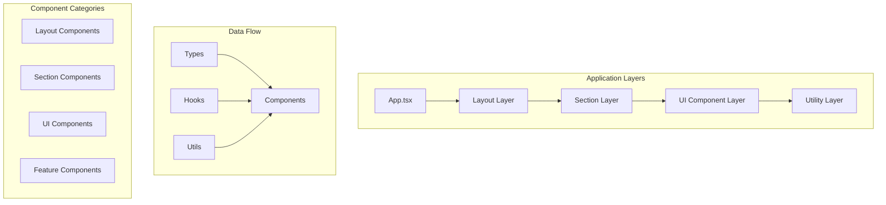

# ADR-002: Frontend Application Architecture

**Author:** Ernesto Jiménez Villaseñor  
**Date:** 2025-09-05  
**References:** ADR-001 (Modern Frontend Stack), React composition patterns  

## Context

Following the decision to migrate to a modern frontend stack with Vite, React, and TypeScript, we need to establish a clear application architecture that promotes maintainability, reusability, and scalability for the CV portfolio project.

The current single-file approach lacks proper separation of concerns and will not scale as we add more sections, components, and features to showcase professional experience and projects.

## Decision

We will implement a **layered component architecture** with domain-driven organization, emphasizing composition over inheritance and clear separation of responsibilities.



### Folder Structure

```
src/
├── components/
│   ├── layout/          # Structural components (Header, Footer, Navigation)
│   ├── sections/        # Portfolio sections (Hero, About, Experience, Projects)
│   ├── ui/             # Reusable UI components (Button, Card, Modal)
│   └── features/       # Complex feature components (ContactForm, ProjectGallery)
├── hooks/              # Custom React hooks for business logic
├── types/              # TypeScript type definitions
├── utils/              # Utility functions and constants
├── assets/             # Static assets (images, icons, documents)
└── styles/             # Global styles and Tailwind configuration
```

## Evaluated Alternatives

| Architecture | Pros | Cons | Decision |
|--------------|------|------|----------|
| **Single File** | ✅ Simple<br/>✅ Fast start | ⚠️ Poor maintainability<br/>⚠️ No reusability | ❌ Rejected |
| **Feature-based** | ✅ Domain isolation<br/>✅ Scalable | ⚠️ Overkill for portfolio<br/>⚠️ Complex structure | ❌ Rejected |
| **Atomic Design** | ✅ Design system<br/>✅ Reusability | ⚠️ Over-engineering<br/>⚠️ Complex hierarchy | ❌ Rejected |
| **Layered Components** | ✅ Clear separation<br/>✅ Balanced complexity<br/>✅ Easy navigation | ⚠️ More initial setup | ✅ **Selected** |

## Justification

### Component Layer Strategy

#### Layout Components (`/layout`)
- **Purpose:** Structural elements that define page layout
- **Examples:** `Header`, `Footer`, `Navigation`, `Sidebar`
- **Characteristics:** Handle routing, global navigation, consistent structure

#### Section Components (`/sections`)
- **Purpose:** Main content areas of the portfolio
- **Examples:** `HeroSection`, `AboutSection`, `ExperienceSection`, `ProjectsSection`
- **Characteristics:** Combine multiple UI components, domain-specific logic

#### UI Components (`/ui`)
- **Purpose:** Reusable, presentational components
- **Examples:** `Button`, `Card`, `Badge`, `Typography`, `Icon`
- **Characteristics:** Pure functions, highly configurable props, no business logic

#### Feature Components (`/features`)
- **Purpose:** Complex components with specific functionality
- **Examples:** `ContactForm`, `ProjectGallery`, `SkillsChart`, `ThemeToggle`
- **Characteristics:** Combine UI components with custom hooks and state management

### Architectural Principles

1. **Composition over Inheritance**
   - Components receive behavior through props and composition
   - No class-based inheritance patterns

2. **Single Responsibility**
   - Each component has one clear purpose
   - Business logic separated into custom hooks

3. **Type Safety**
   - Strongly typed props with TypeScript interfaces
   - Centralized type definitions in `/types`

4. **Reusability**
   - UI components designed for maximum reuse
   - Configuration through props, not modification

## Consequences

### Positive Outcomes
- ✅ **Maintainability:** Clear structure makes finding and updating components intuitive
- ✅ **Reusability:** UI components can be reused across different sections
- ✅ **Testability:** Isolated components are easier to unit test
- ✅ **Scalability:** Architecture supports adding new portfolio sections
- ✅ **Developer Experience:** Consistent patterns reduce cognitive load

### Considerations
- ⚠️ **Initial Complexity:** More files and folders than simple approach
- ⚠️ **Over-abstraction Risk:** Potential to create unnecessary abstractions
- ⚠️ **Import Management:** More import statements across components

### Mitigations
- 🔧 **Index Files:** Use barrel exports for clean imports
- 🔧 **Component Templates:** Create component generation scripts
- 🔧 **Documentation:** Clear component API documentation
- 🔧 **ESLint Rules:** Enforce architectural patterns

## Implementation

### Phase 1: Core Structure
1. Create folder structure and index files
2. Implement base UI components (Button, Card, Typography)
3. Create Layout components (Header, Footer, Navigation)
4. Set up component export patterns

### Phase 2: Content Sections
1. Develop HeroSection with animation
2. Build AboutSection with skills display
3. Create ExperienceSection with timeline
4. Implement ProjectsSection with filtering

### Phase 3: Advanced Features
1. Add ContactForm with validation
2. Implement ThemeToggle for dark/light mode
3. Create ProjectGallery with lightbox
4. Add responsive navigation with mobile menu

### Component Development Guidelines

#### Component Structure Template
```typescript
// Component props interface
interface ComponentNameProps {
  // Strongly typed props
}

// Main component
export const ComponentName: React.FC<ComponentNameProps> = ({ 
  // Destructured props 
}) => {
  // Component logic
  return (
    // JSX with Tailwind classes
  );
};

// Default export
export default ComponentName;
```

#### Custom Hook Pattern
```typescript
export const useComponentName = () => {
  // Hook logic
  return {
    // Exposed state and functions
  };
};
```

## Requirements Coverage

- **Separation of Concerns:** ✅ Clear layer boundaries and responsibilities
- **Reusability:** ✅ Composable UI components across sections
- **Type Safety:** ✅ TypeScript interfaces for all component props
- **Maintainability:** ✅ Organized structure with clear naming conventions
- **Scalability:** ✅ Architecture supports portfolio growth and new features
- **Developer Experience:** ✅ Consistent patterns and easy navigation