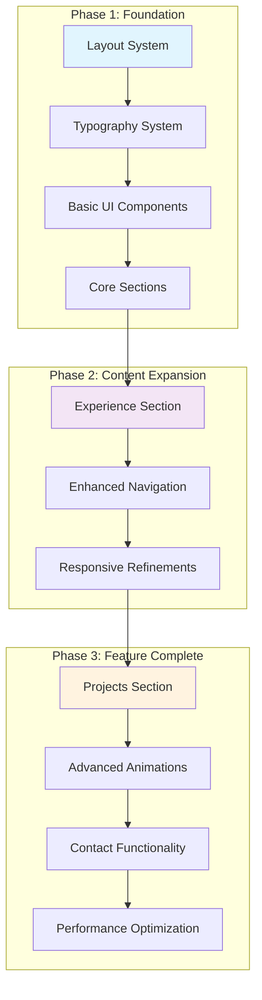
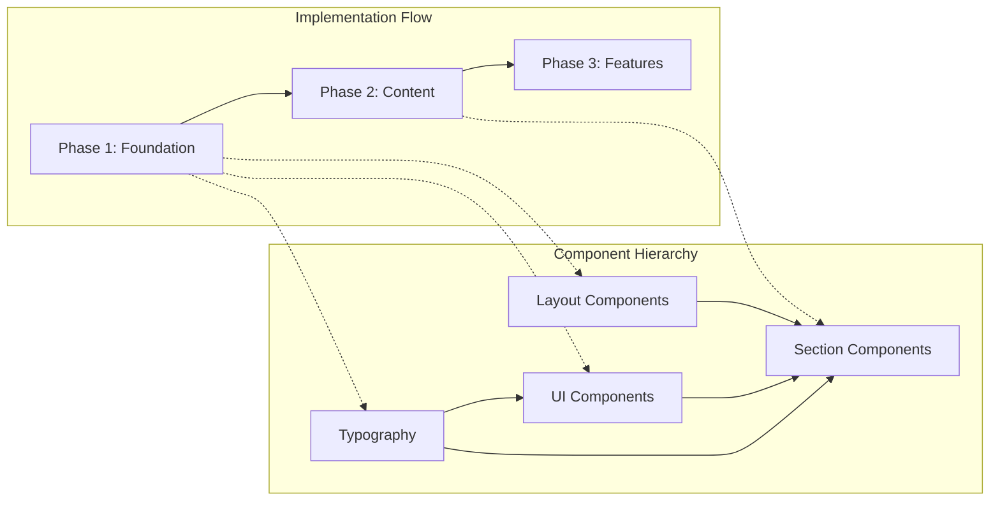
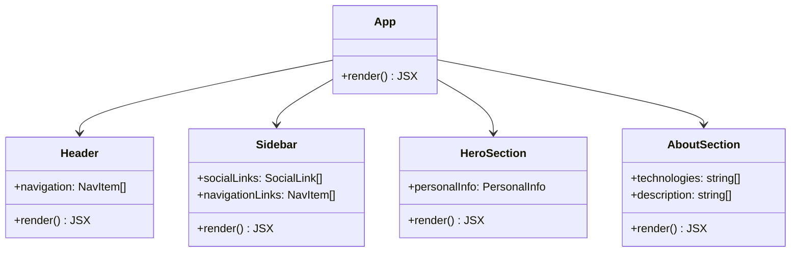
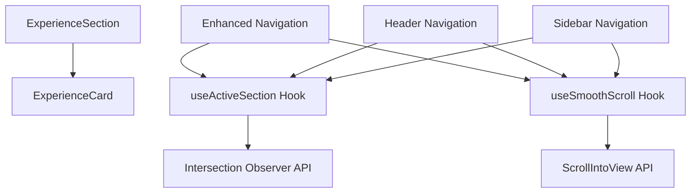
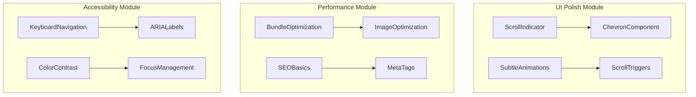
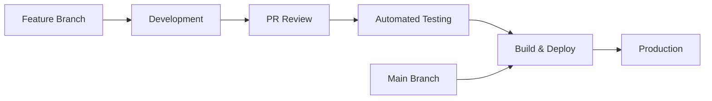
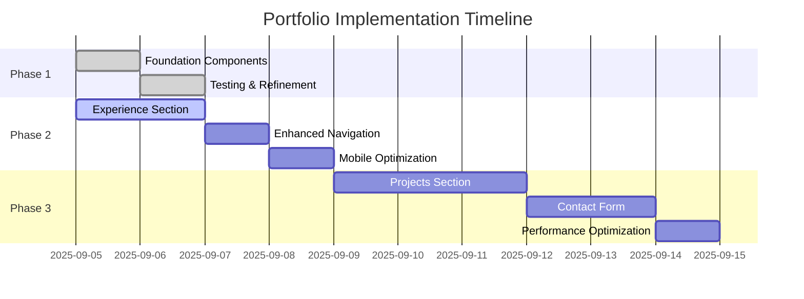

# ADR-003: Implementation Phases Strategy

**Author:** Ernesto Jiménez Villaseñor  
**Date:** 2025-09-05  
**References:** ADR-002 (Frontend Application Architecture), component-inventory.md analysis

## Context

Following the architectural decisions in ADR-002 and the comprehensive component analysis of brittanychiang.com, we need a structured approach to implement the CV portfolio. The implementation should be incremental, testable, and aligned with business priorities while maintaining code quality and user experience standards.

The phased approach ensures we deliver value early while building a solid foundation for future enhancements.

## Decision

We will implement the portfolio in **three distinct phases**, each with clear deliverables, dependencies, and success criteria:



### Phase Dependencies and Architecture



## Implementation Phases

### Phase 1: Foundation (MVP) ✅ **COMPLETED**

**Objective:** Establish core architecture and essential components for a functional portfolio.

**Components Delivered:**

- **Layout System:** `Header`, `Sidebar`, `Main`, `Footer`
- **Typography System:** `Heading`, `Text`, `Link`
- **Basic UI Elements:** `Button`, `Badge`, `Container`
- **Core Sections:** `HeroSection`, `AboutSection`

**Technical Architecture:**



**Success Criteria:**

- ✅ Responsive layout with desktop sidebar (right-aligned)
- ✅ Typography system with consistent styling
- ✅ Basic navigation structure
- ✅ Hero and About sections functional
- ✅ Mobile-first responsive design

**Key Decisions:**

- Desktop sidebar positioning (right-aligned, no content reflow)
- Component-based architecture with TypeScript
- Tailwind utility classes for styling consistency
- Barrel exports for clean import structure

### Phase 2: Content Expansion ✅ **COMPLETED**

**Objective:** Add professional experience showcase and enhance navigation functionality.

**Components Delivered:**

- **Experience Section:** `ExperienceSection`, `ExperienceCard` ✅
- **Enhanced Navigation:** Active section detection, smooth scrolling ✅
- **Custom Hooks:** `useActiveSection`, `useSmoothScroll`, `usePortfolioData` ✅
- **Navigation Improvements:** Header & Sidebar active states ✅
- **Data Centralization:** Hybrid config + abstraction layer pattern ✅
- **Scroll Indicators:** Subtle hero section scroll chevron ✅

**Component Dependencies:**



**Data Structure Implementation:**

```typescript
interface Experience {
  id: string;
  dateRange: string;
  company: string;
  role: string;
  description: string;
  technologies: string[];
  companyUrl?: string;
  location?: string;
  highlights?: string[]; // Added for detailed accomplishments
}
```

**Success Criteria:**

- ✅ **Experience timeline with interactive cards:** Professional timeline with hover effects
- ✅ **Active navigation section highlighting:** Both Header and Sidebar show active states
- ✅ **Smooth scroll behavior between sections:** Custom hook with proper offset calculation
- ✅ **Enhanced visual feedback:** Sidebar indicators and Header active states
- ✅ **Performance optimization for scroll events:** Intersection Observer with proper thresholds
- ✅ **Centralized data management:** Single source of truth with future-ready abstraction layer
- ✅ **Responsive scroll indicators:** Subtle navigation aids with optimal viewport positioning

**Technical Achievements:**

- Intersection Observer API for efficient scroll tracking
- TypeScript interfaces for type-safe component props
- Responsive design with desktop sidebar positioning
- Mock data representing full-stack developer + tech lead experience
- Hover animations and visual feedback on interactive elements
- Centralized data management with `portfolioConfig` and `usePortfolioData` hook
- Responsive scroll indicators with viewport-optimized positioning
- Future-ready architecture for CMS/API integration (documented in ADR-004)

### Phase 3: Polish & Optimization ✅ **COMPLETED**

**Objective:** Polish the existing portfolio with subtle enhancements and performance optimizations while maintaining a minimal, content-focused design.

**Components Delivered:**

- **UI Refinements:** Subtle scroll indicators with responsive positioning ✅
- **Performance:** Bundle optimization (70KB gzipped), asset optimization ✅
- **SEO Implementation:** Complete meta tags, OpenGraph, robots.txt, sitemap ✅
- **Accessibility:** WCAG 2.1 compliance, keyboard navigation, ARIA labels ✅
- **Asset Optimization:** Custom favicon, eliminated unused assets ✅

**Refined Architecture:**



**Success Criteria:**

- ✅ **Subtle scroll indicators and navigation aids:** Responsive positioning for all viewports
- ✅ **Improved accessibility compliance (WCAG 2.1):** Skip-to-content, ARIA labels, focus management
- ✅ **Performance optimization:** Bundle size ~70KB gzipped, build time <400ms
- ✅ **SEO optimization with meta tags:** Complete OpenGraph, Twitter Cards, structured data
- ✅ **Clean, minimal animations that enhance UX:** Subtle hover effects and scroll indicators
- ✅ **Responsive design refinements:** Optimized spacing and positioning across breakpoints

**Technical Achievements:**

- Complete SEO implementation with meta tags, OpenGraph, and structured data
- WCAG 2.1 accessibility compliance with keyboard navigation and ARIA semantics
- Optimized bundle size: 70KB total gzipped (HTML: 0.87KB, CSS: 5KB, JS: 65KB)
- Custom favicon and asset optimization
- Skip-to-content functionality for screen readers
- Focus management and visible focus indicators throughout

## Out of Scope (Future Implementations)

The following components have been identified as valuable but are **excluded from current scope** due to content/infrastructure requirements:

### 🔮 **Future Implementation Backlog**

**Projects Section Module:**

- **Reason for Deferral:** Insufficient project portfolio ready for showcase
- **Components Designed:** `ProjectsSection`, `ProjectCard`, `ProjectsArchive`
- **Future Scope:** When 3-5 quality projects are available for demonstration

**Contact Form Module:**

- **Reason for Deferral:** No backend infrastructure for form handling
- **Components Designed:** `ContactForm`, form validation, email service integration
- **Future Scope:** When backend/email service is available

**Analytics Module:**

- **Reason for Deferral:** Not required for current portfolio objectives
- **Components Considered:** User tracking, performance monitoring, engagement metrics
- **Future Scope:** If portfolio scaling requires user behavior insights

**Advanced Animations:**

- **Reason for Exclusion:** Preference for minimal, content-focused design
- **Philosophy:** "Less is more" approach prioritizing readability and quick information transmission

## Technical Implementation Strategy

### Component Development Patterns

**1. Component Structure:**

```typescript
// Standard component template
interface ComponentProps {
  // Typed props interface
}

export const Component: React.FC<ComponentProps> = (props) => {
  // Component logic
  return (
    // JSX with Tailwind classes
  );
};

export default Component;
```

**2. Custom Hooks Pattern:**

```typescript
// Reusable logic extraction
export const useComponentLogic = () => {
  // Hook implementation
  return {
    // Exposed state and functions
  };
};
```

**3. Type Safety:**

- Strict TypeScript configuration
- Interface definitions for all props
- Centralized type definitions in `/types`

### Testing Strategy

**Phase-based Testing Approach:**

- **Phase 1:** Component unit tests, visual regression tests
- **Phase 2:** Integration tests, navigation flow tests
- **Phase 3:** E2E tests, performance tests, accessibility tests

### Deployment Strategy

**Continuous Deployment Pipeline:**



## Risk Management

### Technical Risks

| Risk                        | Impact | Mitigation                                                      |
| --------------------------- | ------ | --------------------------------------------------------------- |
| **Component Coupling**      | High   | Maintain clear separation of concerns, use dependency injection |
| **Performance Degradation** | Medium | Implement lazy loading, code splitting in Phase 3               |
| **Mobile Responsiveness**   | Medium | Mobile-first approach, extensive device testing                 |
| **Accessibility Issues**    | High   | ARIA labels, keyboard navigation, color contrast compliance     |

### Project Risks

| Risk                   | Impact | Mitigation                                      |
| ---------------------- | ------ | ----------------------------------------------- |
| **Scope Creep**        | Medium | Clear phase boundaries, documented requirements |
| **Timeline Delays**    | Low    | Incremental delivery, flexible phase timing     |
| **Technology Changes** | Low    | Conservative technology choices, LTS versions   |

## Success Metrics

### Phase-specific KPIs

**Phase 1 Metrics:**

- ✅ Component test coverage > 80%
- ✅ Lighthouse performance score > 85
- ✅ Mobile responsiveness across 5+ devices
- ✅ TypeScript strict mode compliance

**Phase 2 Metrics:**

- [ ] Navigation interaction success rate > 95%
- [ ] Page load time < 2s (3G connection)
- [ ] Cross-browser compatibility (Chrome, Firefox, Safari)
- [ ] Accessibility score > 90

**Phase 3 Metrics:**

- [ ] Contact form submission success rate > 98%
- [ ] User engagement time > 2 minutes average
- [ ] SEO score > 90
- [ ] Performance budget compliance

## Implementation Timeline

### Estimated Effort Distribution



## Consequences

### Positive Outcomes

- ✅ **Incremental Value Delivery:** Each phase delivers working functionality
- ✅ **Risk Mitigation:** Early testing and validation reduce later issues
- ✅ **Code Quality:** Structured approach ensures consistent architecture
- ✅ **Maintainability:** Clear separation of concerns and documentation
- ✅ **User Experience:** Progressive enhancement of features

### Considerations

- ⚠️ **Initial Overhead:** Phase planning requires upfront investment
- ⚠️ **Dependency Management:** Changes in early phases may affect later ones
- ⚠️ **Feature Gaps:** Some advanced features delayed to Phase 3

### Mitigations

- 🔧 **Documentation:** Comprehensive ADRs and component documentation
- 🔧 **Version Control:** Tagged releases for each phase completion
- 🔧 **Testing:** Automated testing prevents regression between phases
- 🔧 **Flexibility:** Phase scope can be adjusted based on priorities

## Requirements Coverage

- **Structured Implementation:** ✅ Three-phase approach with clear boundaries
- **Component Architecture:** ✅ Layered system aligned with ADR-002
- **Responsive Design:** ✅ Mobile-first with desktop enhancements
- **Performance Optimization:** ✅ Progressive loading and optimization
- **Maintainability:** ✅ TypeScript, testing, and documentation standards
- **User Experience:** ✅ Accessibility and interaction design priorities
