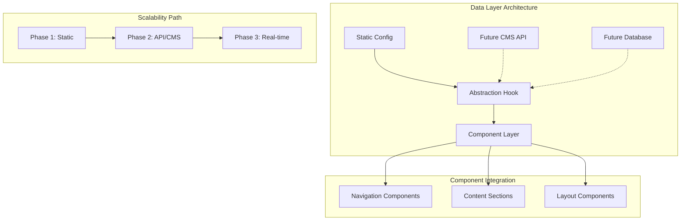

# ADR-004: Centralized Data Management Strategy

**Author:** Ernesto Jiménez Villaseñor  
**Date:** 2025-09-05  
**References:** ADR-002 (Frontend Application Architecture), Portfolio centralization requirements

## Context

Modern applications often suffer from data duplication and inconsistent information across components. As applications scale from static content to dynamic, API-driven systems, maintaining data consistency becomes increasingly challenging.

The portfolio project required a solution that would:

- Eliminate data duplication across components
- Provide a single source of truth for all content
- Enable seamless transition from static to dynamic data sources
- Maintain type safety and developer experience
- Support future integration with headless CMS or external APIs

## Decision

We will implement a **Hybrid Configuration + Abstraction Layer** pattern that combines static configuration with a custom hook abstraction, providing both immediate benefits and future scalability.



## Architecture Pattern

### Core Components

**1. Configuration Layer (Single Source of Truth)**

```typescript
// config/appData.ts
export const appConfig = {
  navigation: [...],
  content: {...},
  metadata: {...},
  // Centralized data structure
} as const;
```

**2. Abstraction Layer (Future-Proof Interface)**

```typescript
// hooks/useAppData.ts
export const useAppData = () => {
  // Current: Static data
  // Future: API calls, caching, etc.
  return {
    navigation: appConfig.navigation,
    getContentById: (id) => findContent(id),
    // Abstracted methods
  };
};
```

**3. Component Integration (Clean Consumption)**

```typescript
// components/Component.tsx
export const Component = () => {
  const { navigation, content } = useAppData();
  // Components remain unchanged during data source migrations
};
```

## Implementation Patterns

### Pattern 1: Static Configuration (Current)

**Use Case:** Small to medium applications with relatively stable content

```typescript
// config/content.ts
export const contentConfig = {
  navigation: [
    { id: 'home', label: 'Home', path: '/' },
    { id: 'about', label: 'About', path: '/about' }
  ],
  pages: {
    home: {
      title: 'Welcome',
      description: 'Application homepage',
      sections: [...]
    }
  },
  metadata: {
    siteName: 'My Application',
    defaultTitle: 'Home | My App'
  }
} as const;

// hooks/useContent.ts
export const useContent = () => {
  return {
    navigation: contentConfig.navigation,
    getPage: (pageId: string) => contentConfig.pages[pageId],
    getSiteMetadata: () => contentConfig.metadata,

    // Future-ready methods
    getNavigationItems: () => contentConfig.navigation,
    getDynamicContent: async (id: string) => {
      // Currently static, future API call
      return contentConfig.pages[id];
    }
  };
};
```

### Pattern 2: API Integration (Future Evolution)

**Use Case:** Dynamic content requirements, multi-user systems

```typescript
// services/contentService.ts
class ContentService {
  private cache = new Map();

  async fetchNavigation(): Promise<NavigationItem[]> {
    if (this.cache.has('navigation')) {
      return this.cache.get('navigation');
    }

    const data = await fetch('/api/navigation').then((r) => r.json());
    this.cache.set('navigation', data);
    return data;
  }

  async fetchPageContent(pageId: string): Promise<PageContent> {
    return fetch(`/api/pages/${pageId}`).then((r) => r.json());
  }
}

// hooks/useContent.ts (Evolved)
export const useContent = () => {
  const [navigation, setNavigation] = useState([]);
  const [loading, setLoading] = useState(false);

  useEffect(() => {
    ContentService.fetchNavigation().then(setNavigation);
  }, []);

  return {
    navigation,
    loading,
    getPage: (pageId: string) => ContentService.fetchPageContent(pageId),
    // Same interface, different implementation
  };
};
```

### Pattern 3: Headless CMS Integration

**Use Case:** Non-technical content management, frequent updates

```typescript
// config/cms.ts
export const cmsConfig = {
  endpoint: process.env.CMS_ENDPOINT,
  apiKey: process.env.CMS_API_KEY,
  cacheTimeout: 5 * 60 * 1000, // 5 minutes
};

// services/cmsService.ts
class CMSService {
  private client = createCMSClient(cmsConfig);

  async getNavigation() {
    return this.client.getEntries({
      content_type: 'navigation',
      order: 'fields.order',
    });
  }

  async getPageContent(slug: string) {
    return this.client.getEntries({
      content_type: 'page',
      'fields.slug': slug,
      limit: 1,
    });
  }
}

// hooks/useContent.ts (CMS Evolution)
export const useContent = () => {
  const { data: navigation } = useQuery(
    'navigation',
    () => CMSService.getNavigation(),
    { staleTime: cmsConfig.cacheTimeout }
  );

  return {
    navigation,
    getPage: (slug: string) =>
      useQuery(['page', slug], () => CMSService.getPageContent(slug)),
    // Same interface, CMS-powered
  };
};
```

## Migration Strategies

### Phase 1 → Phase 2: Static to API

```typescript
// Before (Static)
export const useContent = () => ({
  navigation: staticConfig.navigation
});

// After (API) - Same interface!
export const useContent = () => {
  const [navigation] = useAsyncData('navigation', fetchNavigation);
  return { navigation };
};

// Components remain unchanged ✅
const NavComponent = () => {
  const { navigation } = useContent(); // Still works!
  return <nav>{/* render */}</nav>;
};
```

### Phase 2 → Phase 3: API to Real-time

```typescript
// Phase 2: REST API
export const useContent = () => {
  const [data] = useFetch('/api/content');
  return { content: data };
};

// Phase 3: WebSocket/Real-time
export const useContent = () => {
  const [data] = useWebSocket('/ws/content');
  return { content: data }; // Same interface!
};
```

## Scalability Examples

### Example 1: E-commerce Product Catalog

```typescript
// Phase 1: Static product data
const productsConfig = {
  categories: [...],
  products: [...],
  filters: [...]
};

// Phase 2: API-driven catalog
const useProducts = () => {
  const getProducts = (filters) => api.get('/products', { params: filters });
  const getCategories = () => api.get('/categories');
  return { getProducts, getCategories };
};

// Phase 3: Real-time inventory
const useProducts = () => {
  const { data: products } = useRealtimeQuery('products');
  const { data: inventory } = useWebSocket('/inventory');
  return { products, inventory };
};
```

### Example 2: Blog/CMS Content

```typescript
// Phase 1: Markdown files
const blogConfig = {
  posts: await loadMarkdownPosts(),
  authors: [...],
  categories: [...]
};

// Phase 2: Headless CMS
const useBlog = () => {
  const getPosts = () => cms.getEntries({ content_type: 'post' });
  const getAuthors = () => cms.getEntries({ content_type: 'author' });
  return { getPosts, getAuthors };
};

// Phase 3: Multi-source aggregation
const useBlog = () => {
  const cmsData = useCMS();
  const socialData = useSocialFeeds();
  const analyticsData = useAnalytics();

  return {
    posts: mergeData(cmsData, socialData),
    metrics: analyticsData
  };
};
```

### Example 3: User Dashboard

```typescript
// Phase 1: Mock user data
const userConfig = {
  profile: mockUser,
  settings: defaultSettings,
  notifications: [],
};

// Phase 2: User-specific API
const useUser = () => {
  const { data: profile } = useQuery('profile', fetchUserProfile);
  const { data: settings } = useQuery('settings', fetchUserSettings);
  return { profile, settings };
};

// Phase 3: Personalized real-time
const useUser = () => {
  const profile = useRealtimeUser();
  const notifications = useWebSocket(`/user/${userId}/notifications`);
  const recommendations = useMLRecommendations(profile.preferences);

  return { profile, notifications, recommendations };
};
```

## Technical Implementation Guidelines

### 1. Interface Consistency

```typescript
// Define stable interfaces that don't change
interface ContentHook {
  navigation: NavigationItem[];
  loading: boolean;
  error?: string;
  getContent: (id: string) => Promise<Content>;
  refresh: () => void;
}

// All implementations follow the same interface
export const useContent = (): ContentHook => {
  // Implementation varies, interface remains stable
};
```

### 2. Graceful Degradation

```typescript
export const useContent = () => {
  try {
    // Try dynamic data first
    return useDynamicContent();
  } catch (error) {
    // Fallback to static data
    console.warn('Falling back to static content:', error);
    return useStaticContent();
  }
};
```

### 3. Performance Considerations

```typescript
export const useContent = () => {
  // Caching layer
  const cache = useCache();

  // Optimistic updates
  const mutate = useMutation(updateContent, {
    onMutate: (variables) => {
      cache.setQueryData(['content'], variables);
    },
  });

  return { content, mutate };
};
```

## Best Practices

### Do's ✅

- **Single Responsibility:** Each config file handles one domain
- **Type Safety:** Use TypeScript interfaces for all data structures
- **Future Compatibility:** Design hooks with extensibility in mind
- **Error Handling:** Implement fallbacks for data loading failures
- **Performance:** Use caching and memoization appropriately
- **Testing:** Mock the hook, not individual API calls

### Don'ts ❌

- **Direct API Calls in Components:** Always use the abstraction layer
- **Breaking Interface Changes:** Evolve interfaces, don't replace them
- **Tight Coupling:** Components should not know about data sources
- **Missing Fallbacks:** Always provide default/loading states
- **Ignoring Performance:** Consider caching, debouncing, and pagination

## Migration Path Template

```typescript
// Step 1: Identify data duplication
const DuplicatedComponent = () => {
  const hardcodedData = [...]; // ❌ Duplicate data
  return <div>{/* render */}</div>;
};

// Step 2: Create centralized config
const centralConfig = {
  data: [...] // ✅ Single source
};

// Step 3: Create abstraction hook
const useAppData = () => ({
  data: centralConfig.data,
  // Future: API calls, caching, etc.
});

// Step 4: Refactor components
const RefactoredComponent = () => {
  const { data } = useAppData(); // ✅ Centralized access
  return <div>{/* render */}</div>;
};

// Step 5: Evolve to dynamic sources
const useAppData = () => {
  // return staticData; // Phase 1
  // return await fetchAPI(); // Phase 2
  // return useWebSocket(); // Phase 3
};
```

## Consequences

### Positive Outcomes

- ✅ **Single Source of Truth:** Eliminates data inconsistencies
- ✅ **Scalability:** Seamless evolution from static to dynamic
- ✅ **Maintainability:** Changes propagate automatically
- ✅ **Type Safety:** End-to-end TypeScript support
- ✅ **Testability:** Easy to mock and test data layer
- ✅ **Performance:** Centralized caching and optimization

### Considerations

- ⚠️ **Initial Overhead:** Requires upfront architectural planning
- ⚠️ **Learning Curve:** Team needs understanding of abstraction patterns
- ⚠️ **Over-engineering Risk:** May be excessive for very simple applications

### Mitigations

- 🔧 **Progressive Adoption:** Start simple, evolve as needed
- 🔧 **Documentation:** Clear examples and migration guides
- 🔧 **Tooling:** Development tools to validate data consistency
- 🔧 **Monitoring:** Track performance impact of data layer changes

## Success Metrics

- **Code Reuse:** Reduction in duplicate data definitions
- **Consistency:** Zero data inconsistencies across components
- **Migration Time:** Time to switch data sources (target: < 1 day)
- **Developer Experience:** Faster feature development
- **Performance:** Maintained or improved application performance
- **Maintainability:** Reduced time for global content updates
