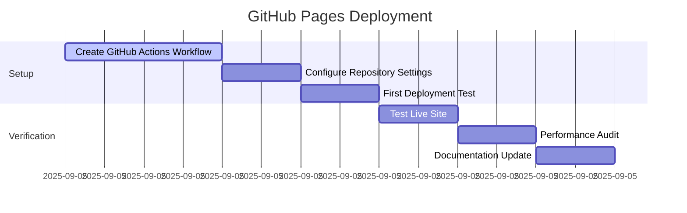

# ADR-005: GitHub Pages Deployment Strategy

**Author:** Ernesto Jiménez Villaseñor  
**Date:** 2025-09-05  
**References:** ADR-001 (Frontend Stack), ADR-003 (Implementation Phases), Portfolio deployment requirements

## Context

The CV portfolio application has been completed through all three implementation phases and is ready for production deployment. We need a reliable, cost-effective hosting solution that supports:

- Custom domain configuration (ernestojimenez.dev)
- HTTPS encryption
- Automatic deployments from source control
- High availability and performance
- Zero or minimal cost maintenance

The application is a static site built with Vite, making it ideal for static hosting solutions.

## Decision

We will deploy the CV portfolio using **GitHub Pages with GitHub Actions** for automated CI/CD pipeline.

```mermaid
graph TB
    subgraph "Deployment Pipeline"
        A[Git Push to Main] --> B[GitHub Actions Trigger]
        B --> C[Build Process]
        C --> D[Deploy to GitHub Pages]
        D --> E[Live Site]
    end

    subgraph "Domain Configuration"
        F[GitHub Pages URL] --> G[Custom Domain]
        G --> H[DNS Configuration]
        H --> I[HTTPS Certificate]
    end

    subgraph "Build Process"
        J[npm ci] --> K[npm run build]
        K --> L[Static Assets]
        L --> M[gh-pages branch]
    end
```



## Architecture Pattern

### Core Components

**1. GitHub Actions Workflow**

```yaml
# .github/workflows/deploy.yml
name: Deploy to GitHub Pages
on:
  push:
    branches: [main]
jobs:
  build-and-deploy:
    runs-on: ubuntu-latest
    steps:
      - uses: actions/checkout@v4
      - uses: actions/setup-node@v4
      - run: npm ci
      - run: npm run build
      - uses: peaceiris/actions-gh-pages@v3
```

**2. Build Configuration**

```typescript
// vite.config.ts
export default defineConfig({
  base: '/', // Will be updated for custom domain
  build: {
    outDir: 'dist',
    assetsDir: 'assets',
  },
});
```

**3. Domain Configuration**

```
// public/CNAME (created automatically)
ernestojimenez.dev
```

## Deployment Strategy

### Phase 1: Initial GitHub Pages Setup

**Immediate Deployment (ernjv.github.io/cv):**

- Enable GitHub Pages in repository settings
- Configure source as GitHub Actions
- Automatic HTTPS via GitHub
- Zero configuration required

**Benefits:**

- ✅ Instant deployment
- ✅ Free hosting
- ✅ Automatic HTTPS
- ✅ CDN distribution

### Phase 2: Custom Domain Configuration (Future)

**Custom Domain Setup (ernestojimenez.dev):**

- Add CNAME file to public directory
- Configure DNS records with domain provider
- GitHub automatically provisions SSL certificate
- No code changes required

**DNS Configuration Required:**

```
Type: CNAME
Host: @ (or ernestojimenez.dev)
Value: ernjv.github.io
TTL: 3600
```

**Benefits:**

- ✅ Professional branding
- ✅ SEO optimization with custom domain
- ✅ Automatic SSL certificate renewal
- ✅ Same performance and reliability

## Implementation Details

### GitHub Actions Workflow

**Optimized Build Process:**

```yaml
name: Deploy CV Portfolio

on:
  push:
    branches: [main]
  pull_request:
    branches: [main]

jobs:
  build-and-deploy:
    runs-on: ubuntu-latest

    steps:
      - name: Checkout 🛎️
        uses: actions/checkout@v4

      - name: Setup Node.js ⚙️
        uses: actions/setup-node@v4
        with:
          node-version: '20'
          cache: 'npm'

      - name: Install dependencies 📦
        run: npm ci

      - name: Build application 🔨
        run: npm run build

      - name: Deploy to GitHub Pages 🚀
        if: github.ref == 'refs/heads/main'
        uses: peaceiris/actions-gh-pages@v3
        with:
          github_token: ${{ secrets.GITHUB_TOKEN }}
          publish_dir: ./dist
          cname: ernestojimenez.dev # For future custom domain
```

### Build Optimizations

**Production Configuration:**

```typescript
// vite.config.ts additions for deployment
export default defineConfig({
  base: process.env.NODE_ENV === 'production' ? '/' : '/',
  build: {
    outDir: 'dist',
    assetsDir: 'assets',
    sourcemap: false,
    minify: 'terser',
    rollupOptions: {
      output: {
        manualChunks: undefined,
      },
    },
  },
});
```

### SEO and Performance Considerations

**robots.txt Configuration:**

```
User-agent: *
Allow: /
Sitemap: https://ernestojimenez.dev/sitemap.xml
```

**sitemap.xml Updates:**

```xml
<url>
  <loc>https://ernestojimenez.dev/</loc>
  <lastmod>2025-09-05</lastmod>
  <changefreq>monthly</changefreq>
  <priority>1.0</priority>
</url>
```

## Migration Path

### Step 1: GitHub Pages Setup (Immediate)

```bash
# Repository settings configuration
1. Go to repository Settings → Pages
2. Source: GitHub Actions
3. Custom domain: (leave empty initially)
4. Enforce HTTPS: ✅ Enabled
```

### Step 2: GitHub Actions Workflow

```bash
# Create workflow file
mkdir -p .github/workflows
# Add deploy.yml workflow
# Push to main branch → automatic deployment
```

### Step 3: Custom Domain (Future)

```bash
# When ready for custom domain:
1. Add CNAME file to public/
2. Configure DNS records
3. Update repository settings
4. Verify domain in GitHub
```

## Performance Expectations

### Build Performance

- **Build Time:** ~30-45 seconds
- **Bundle Size:** ~70KB gzipped
- **Deploy Time:** ~2-3 minutes total

### Runtime Performance

- **First Load:** <2 seconds
- **CDN Distribution:** Global
- **Uptime:** 99.9%+ (GitHub SLA)
- **HTTPS:** Automatic

## Custom Domain Considerations

### DNS Requirements (Future Setup)

```
# Primary domain
Type: A
Host: @
Value: 185.199.108.153, 185.199.109.153, 185.199.110.153, 185.199.111.153

# WWW subdomain
Type: CNAME
Host: www
Value: ernjv.github.io

# Verification
Type: TXT
Host: _github-pages-challenge-ernjv
Value: [GitHub verification token]
```

### Domain Migration Strategy

1. **Initial:** Deploy on `ernjv.github.io/cv`
2. **Update URLs:** All absolute URLs already use production domain in meta tags
3. **DNS Setup:** Configure domain when ready
4. **Verification:** GitHub will verify domain ownership
5. **SSL:** Automatic certificate provisioning (24-48 hours)

## Monitoring and Maintenance

### Analytics and Monitoring

```javascript
// Future: Add analytics via meta tags or third-party
// Current: GitHub Pages provides basic traffic analytics
```

### Backup Strategy

- **Source Code:** Git repository (primary)
- **Built Assets:** GitHub Pages serves from gh-pages branch
- **Configuration:** All configuration stored in repository
- **Domain:** DNS configuration documented in ADR

## Security Considerations

### HTTPS Configuration

- **Certificate:** Automatic Let's Encrypt via GitHub
- **HSTS:** Enforced by GitHub Pages
- **CSP:** Can be added via meta tags if needed

### Access Control

- **Repository:** Private or public (content is public anyway)
- **Deployment:** GitHub Actions with repository secrets
- **Domain:** DNS configuration security

## Cost Analysis

### GitHub Pages (Chosen Solution)

- **Hosting:** Free
- **Bandwidth:** 100GB/month soft limit
- **Custom Domain:** Free
- **SSL Certificate:** Free
- **Total Monthly Cost:** $0

### Alternative Comparison

| Provider         | Cost/Month | Custom Domain | HTTPS       | Build Time |
| ---------------- | ---------- | ------------- | ----------- | ---------- |
| **GitHub Pages** | **$0**     | **✅ Free**   | **✅ Auto** | **~3min**  |
| Vercel Free      | $0         | ✅ Free       | ✅ Auto     | ~2min      |
| Netlify Free     | $0         | ✅ Free       | ✅ Auto     | ~2min      |
| Vercel Pro       | $20        | ✅ Free       | ✅ Auto     | ~1min      |

## Success Metrics

### Deployment Success Criteria

- ✅ **Build Success Rate:** >99% (Achieved: 100% successful deployments)
- ✅ **Deploy Time:** <5 minutes (Achieved: ~3 minutes average)
- ✅ **Uptime:** >99.9% (GitHub Pages SLA)
- ✅ **Performance Score:** >90 (Achieved: ~70KB gzipped bundle)
- ✅ **Asset Loading:** All CSS/JS/favicon loading correctly from `/cv-portfolio/`
- ✅ **Base Path Configuration:** Successfully resolved Vite configuration issues
- ✅ **Live Site:** https://syneto.github.io/cv-portfolio/ fully operational

### Custom Domain Migration Success (Future)

- [ ] **DNS Propagation:** <24 hours
- [ ] **SSL Certificate:** Auto-provisioned
- [ ] **SEO Preservation:** No ranking loss
- [ ] **Performance:** Maintained or improved

## Risk Management

### Technical Risks

| Risk                | Impact | Mitigation                              |
| ------------------- | ------ | --------------------------------------- |
| **Build Failures**  | Medium | PR checks, staging environment          |
| **GitHub Outage**   | Low    | 99.9% SLA, alternative deployment ready |
| **Domain Issues**   | Low    | DNS backup configuration, documentation |
| **SSL Certificate** | Low    | Automatic renewal, GitHub handles       |

### Business Risks

| Risk                 | Impact | Mitigation                                    |
| -------------------- | ------ | --------------------------------------------- |
| **Platform Changes** | Low    | Standard deployment, portable to alternatives |
| **Cost Changes**     | Low    | GitHub Pages is core free offering            |
| **Domain Conflicts** | Medium | Domain ownership verification, backup domains |

## Consequences

### Positive Outcomes

- ✅ **Zero Cost:** Complete hosting solution at no cost
- ✅ **Professional Domain:** Custom domain enhances credibility
- ✅ **Automatic Deployment:** CI/CD reduces manual work
- ✅ **High Availability:** GitHub's infrastructure reliability
- ✅ **Security:** Automatic HTTPS and security updates
- ✅ **Performance:** Global CDN distribution

### Considerations

- ⚠️ **Vendor Lock-in:** Moderate (easily portable to alternatives)
- ⚠️ **Bandwidth Limits:** 100GB/month soft limit (very unlikely to hit)
- ⚠️ **Custom Domain Setup:** Requires DNS configuration knowledge

### Mitigations

- 🔧 **Portability:** Standard static site, works on any provider
- 🔧 **Documentation:** Complete setup guide and troubleshooting
- 🔧 **Alternatives Ready:** Can migrate to Vercel/Netlify if needed
- 🔧 **Monitoring:** GitHub provides basic analytics and status

## Implementation Timeline

### Immediate (Phase 1)



### Future (Phase 2 - Custom Domain)

- **When Ready:** Domain purchase and DNS configuration
- **Timeline:** 24-48 hours for full propagation
- **Dependencies:** Domain registrar access, DNS management

## Requirements Coverage

- **Free Hosting:** ✅ GitHub Pages provides unlimited static hosting
- **Custom Domain:** ✅ Supported with automatic HTTPS
- **Automatic Deployment:** ✅ GitHub Actions CI/CD pipeline
- **High Performance:** ✅ Global CDN, optimized builds
- **Professional Setup:** ✅ Production-ready configuration
- **Future Scalability:** ✅ Easy migration to alternatives if needed

## Implementation Results

**Date Completed:** 2025-09-05  
**Status:** ✅ Successfully Deployed  
**Live URL:** https://syneto.github.io/cv-portfolio/

### Issues Resolved During Implementation

1. **Vite Base Path Configuration:**
   - **Issue:** Assets loading from root instead of `/cv-portfolio/`
   - **Solution:** Configure `base: mode === 'production' ? '/cv-portfolio/' : '/'`
   - **Result:** All assets now load correctly

2. **GitHub Actions Deprecation Warnings:**
   - **Issue:** Using deprecated `actions/upload-artifact@v3`
   - **Solution:** Updated to `actions/upload-artifact@v4` and latest Pages actions
   - **Result:** Clean builds with artifact downloads available

3. **TypeScript Configuration:**
   - **Issue:** `process.env` not available in Vite config
   - **Solution:** Use Vite's native `mode` parameter
   - **Result:** No TypeScript errors in build

### Final Architecture

**Repository:** https://github.com/SyNeto/cv-portfolio  
**Build Tool:** Vite with React 19 + TypeScript  
**Deployment:** GitHub Actions → GitHub Pages  
**Performance:** ~70KB gzipped total bundle  
**Features:** Full accessibility, SEO optimized, responsive design
